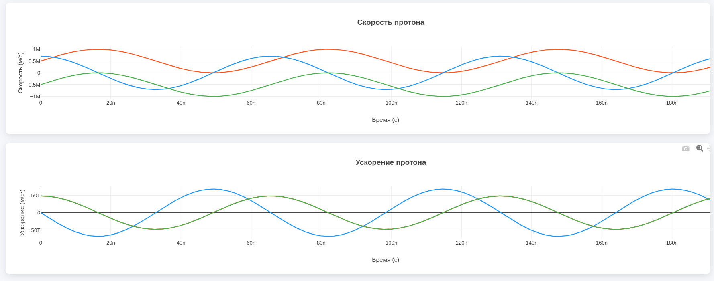
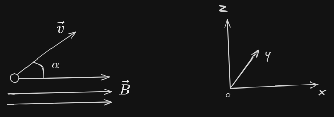
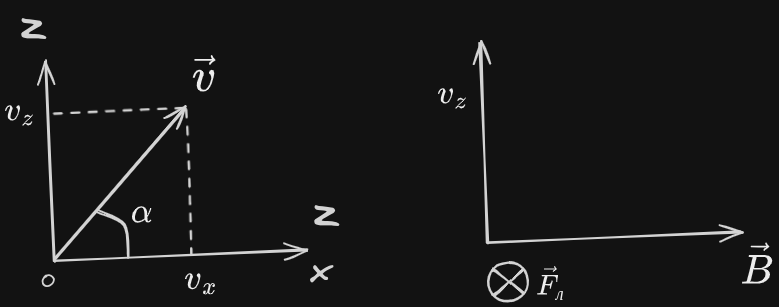
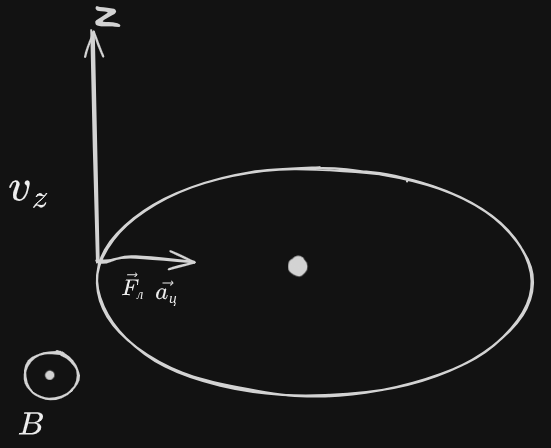
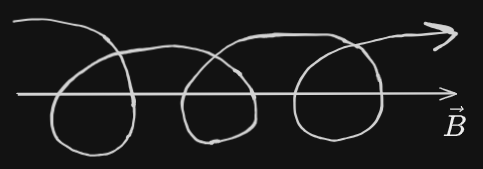

# angry-protons

# Задача
Протон влетает в магнитное поле так как его “запустил” пользователь (может под углом
не только прямым). Необходимо рассчитать траекторию полета протона в поле.
Построить графики траектории, зависимости скорости от времени, зависимости
ускорения от времени.

## Дополнительные задания
- “запустить” протон так, чтобы он попал в определенную цель
- протон влетает в неоднородное магнитное поле

# Скриншоты

# Теоритическое обоснование
1) Однородное магнитное поле B
    Пусть скорость частицы - $\vec{v}$, угол $\vec{v}$ по отношению к полю $\vec{B}$ - $\alpha$:

    

    Выберем систему координат так, что ось $x || \vec{B}$, вектор $\vec{v}$ лежит в плоскости xOz

    

    Для движения вдоль поля (вдоль x):
    $v_x = const = v cos \alpha$

    Для движения в плоскости yOz:

    $m\vec{a_ц} = q[\vec{v}\vec{B}] = q v_z B = q v B sin \alpha$

    

    Движение по окружности: $\frac{m v_z^2}{R} = q v_z B$

    $\frac{m v_z}{R} = qB => R = \frac{m v sin \alpha}{qB}$ (или можно аналогично посчитать по теореме Пифагора)

    $v_z = wR; w = \frac{v_z}{R} = \frac{qB}{m}$ - угловая частота вращения

    $T = \frac{2 \pi}{ w} = \frac{2 \pi m}{qB}$ - период вращения

    Движение частицы - это движение по спирали:

    1) по окружности в плоскости yOz
    2) поступательно движение вдоль Ox

    

    Таким образом, получим уравнение траектории, координаты которой уже можно рассчитать в программе в цикле t:

    $z = R cos wt$

    $y = R sin wt$

    $z = v_xt = v cos \alpha t$

    Для произвольного направления вектора $\vec{B}$, используется матрица поворота:

    $R(\theta,\phi) = \begin{pmatrix} \cos\phi \cos\theta & -\sin\phi & \cos\phi \sin\theta \\ \sin\phi \cos\theta & \cos\phi & \sin\phi \sin\theta \\ -\sin\theta & 0 & \cos\theta \end{pmatrix}$

2) Неоднородное поле
    При моделировании используется линеаризованное поле:

    $\vec{B}(\vec{r}) = \vec{B}_0 + (\nabla\vec{B})\cdot\vec{r}$

    Для случая неоднородного поля добавим интегрирование при помощи метода Эйлера:

    $\begin{aligned}\vec{a}_n &= \frac{q}{m}(\vec{v}_n \times \vec{B}(\vec{r}_n)) \\ \vec{v}_{n+1} &= \vec{v}_n + \vec{a}_n \Delta t \\ \vec{r}_{n+1} &= \vec{r}_n + \vec{v}_n \Delta t \end{aligned}$

    Где $\Delta t$ - шаг интегрирования

3) Проверка попадания в цель

    Цель задается сферой с центром $(x_t, y_t, z_t)$ и радиусом $R_t$. Попадание регистрируется при выполнении условия:

    $\sqrt{(x - x_t)^2 + (y - y_t)^2 + (z - z_t)^2} \leq R_t$ для любой точки траектории